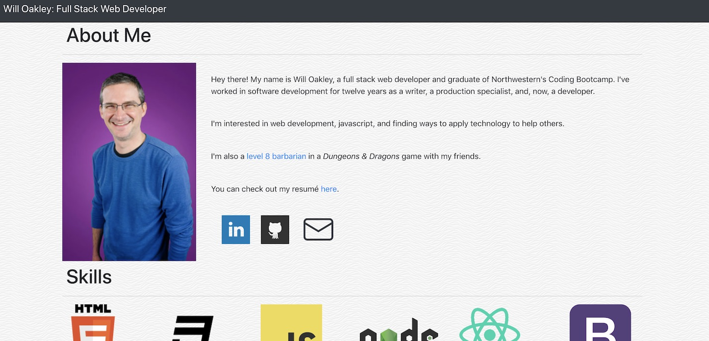
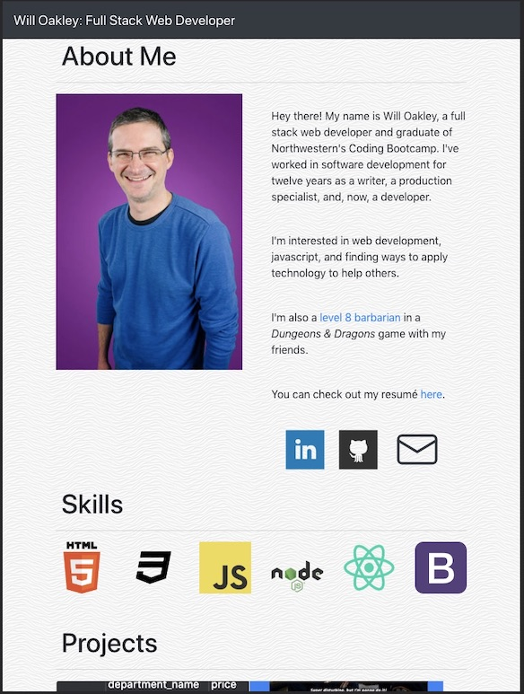
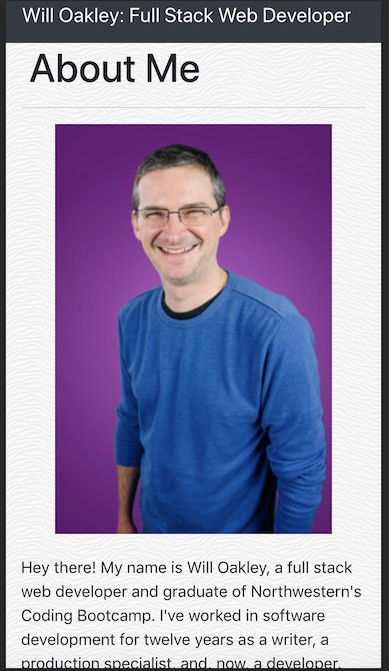
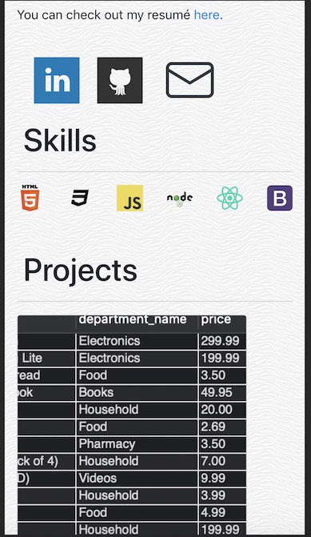

# react-portfolio
A portfolio page of my work I built using react. I maintain it as a showcase for my projects.

https://woaky1.github.io/react-portfolio/

## Website Organization
This pages's structure is entirely front end and follows the basic organization the "create-react-app" produces.

### Public
These include the index file that is directly displayed by the browser and the robots.txt file, which determines which files web robots can access.

### Source
These are the React files that drive the experience. Among the more important files here are:
* index.js: This is where React is actually rendering the page.
* App.js: This component provides the general structure of the page and holds global functions and variables the app needs.
* Header.js: This contains the header bar seen at the top of the page.
* Bio.js: This component creates the box containing my quick bio toward the top of the page.
* Skills.js: This component creates the box containing icons of the technologies I'm most familiar with.
* ProjectGrid.js: This component is used to create the grid we populate the information about projects into.
* projectData.json: This json file containts all the infomation about the projects that gets populated into the Project Grid.
* Project.js: This component takes the information for one project from projectData.json and populates it into a Bootstrap card for display in the Project Grid.
* Footer.js: This contains the simple footer seen at the bottom of the page.

## Responsive Design
This portfolio page has been built to be responsive to different screen sizes. I did this by using the Bootstrap-React npm package as well as some media queries via CSS3.

**Here's how the site looks on a laptop screen:**
 

 

**On an iPad:**
 

 

**On an iPhone 6:**
 

 

## Technology Used
This page uses HTML5, CSS3, React, Bootstrap-React, Bootstrap Icons, and the gh-pages npm package to help me deploy to GitHub Pages.

## About Me
I'm a full stack web developer. Thanks for taking the time to check out my portfolio.